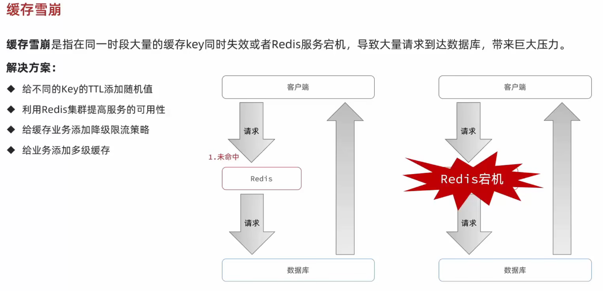

# 黑马点评项目笔记

## 项目概述

- 相关模型

>该项目采用前后端分离开发模式。手机或 app 端发起请求至 Nginx 服务器，Nginx 基于七层模型走 HTTP 协议，可基于 Lua 绕开Tomcat 访问 Redis，也可作静态资源服务器，能扛上万并发，将流量负载均衡到下游 Tomcat 服务器。一台 4 核 8G 的 Tomcat经优化处理简单业务，最多处理 1000 左右并发，经 Nginx 分流后，利用集群支撑项目。Nginx 部署前端项目后可动静分离，降低 Tomcat压力，是项目重要一环。
>
>Tomcat 支撑并发流量后，若直接访问 Mysql，企业级 Mysql 服务器虽配置高，但上万并发会使其 CPU、硬盘打满易崩溃。所以高并发场景下，会用Mysql 集群，为降低 Mysql 压力、增加访问性能，还会加入 Redis 集群，让 Redis 提供更好服务。

- sql分析

| 表               | 说明                      |
| ---------------- | ------------------------- |
| tb_user          | 用户表                    |
| tb_user_info     | 用户详情表                |
| tb_shop          | 商户信息表                |
| tb_shop_type     | 商户类型表                |
| tb_blog          | 用户日记表（达人探店日记) |
| tb_follow        | 用户关注表                |
| tb_voucher       | 优惠券表                  |
| tb_voucher_order | 优惠券的订单表            |


## 短信登录

### 验证码登录

>逻辑：
>
>- 发送验证码
>
>用户在提交手机号后，会校验手机号是否合法，如果不合法，则要求用户重新输入手机号
>如果手机号合法，后台此时生成对应的验证码，同时将验证码进行保存，然后再通过短信的方式将验证码发送给用户
>
>- 短信验证码登录、注册
>
>用户将验证码和手机号进行输入，后台从session中拿到当前验证码，然后和用户输入的验证码进行校验，如果不一致，则无法通过校验，如果一致，则后台根据手机号查询用户，如果用户不存在，则为用户创建账号信息，保存到数据库，无论是否存在，都会将用户信息保存到session中，方便后续获得当前登录信息
>
>- 校验登录状态
>
>用户在请求的时候，会从cookie中携带JsessionId到后台，后台通过JsessionId从session中拿到用户信息，如果没有session信息，则进行拦截，如果有session信息，则将用户信息保存到threadLocal中，并放行


### 引入正则工具类（校验手机号、邮箱）

```java
package com.hmdp.utils;

import cn.hutool.core.util.StrUtil;

public class RegexUtils {
    /**
     * 是否是无效手机格式
     *
     * @param phone 要校验的手机号
     * @return true:符合，false：不符合
     */
    public static boolean isPhoneInvalid(String phone) {
        return mismatch(phone, RegexPatterns.PHONE_REGEX);
    }

    /**
     * 是否是无效邮箱格式
     *
     * @param email 要校验的邮箱
     * @return true:符合，false：不符合
     */
    public static boolean isEmailInvalid(String email) {
        return mismatch(email, RegexPatterns.EMAIL_REGEX);
    }

    /**
     * 是否是无效验证码格式
     *
     * @param code 要校验的验证码
     * @return true:符合，false：不符合
     */
    public static boolean isCodeInvalid(String code) {
        return mismatch(code, RegexPatterns.VERIFY_CODE_REGEX);
    }

    // 校验是否不符合正则格式
    private static boolean mismatch(String str, String regex) {
        if (StrUtil.isBlank(str)) {
            return true;
        }
        return !str.matches(regex);
    }
}
```

### 引入正则常量类

```java
public abstract class RegexPatterns {
    /**
     * 手机号正则
     */
    public static final String PHONE_REGEX = "^1([38][0-9]|4[579]|5[0-3,5-9]|6[6]|7[0135678]|9[89])\\d{8}$";
    /**
     * 邮箱正则
     */
    public static final String EMAIL_REGEX = "^[a-zA-Z0-9_-]+@[a-zA-Z0-9_-]+(\\.[a-zA-Z0-9_-]+)+$";
    /**
     * 密码正则。4~32位的字母、数字、下划线
     */
    public static final String PASSWORD_REGEX = "^\\w{4,32}$";
    /**
     * 验证码正则, 6位数字或字母
     */
    public static final String VERIFY_CODE_REGEX = "^[a-zA-Z\\d]{6}$";

}
```

引用胡图工具包，生成6位验证码（真实开发中 调用阿里云短信平台等等）

```java
 //引用胡图工具包，生成验证码
RandomUtil.randomNumbers(6);
//随机生成用户名（user_+10位随机）
user.setNickName(SystemConstants.USER_NICK_NAME_PREFIX + RandomUtil.randomString(10));
```

### 引入拦截器

```java
implements HandlerInterceptor
```

> 这是一个Spring MVC的登录拦截器实现，继承`HandlerInterceptor`接口，包含三个核心方法：
>
> 1. `preHandle` - 请求处理前执行（登录验证逻辑应写在这里，返回true放行，false拦截）
> 2. `postHandle` - 控制器执行后，视图渲染前调用
> 3. `afterCompletion` - 整个请求完成后调用（资源清理）
>
> 在preHandle中检查session/cookie中的登录凭证，未登录则重定向到登录页。.
>
> > ```java
> >@Configuration
> >public class MvcConfig implements WebMvcConfigurer {
> >
> >    /**
> >     * 添加拦截器
> >     *
> >     * @param registry
> >     */
> >    public void addInterceptors(InterceptorRegistry registry) {
> >        registry.addInterceptor(new LoginInterceptor())
> >                .excludePathPatterns(
> >                );
> >    }
> >}
> >```
> >使用胡图工具类实现登录脱敏
> >
> >```java
> >session.setAttribute(VariousConstants.USER, BeanUtil.copyProperties(user, UserDTO.class));
> >```

### 解决集群的session共享问题

> session共享问题:多台Tomcat并不共享session存储空间，当请求切换到不同tomcat服务时导致数据丢失的问题。


> session的替代方案应该满足：
>
>数据共享、内存存储、key，value存储结构（Redis）
>
>以手机号为key，取value(不安全)->以随机的token作为key(唯一且安全)


### 注入StringRedisTemplate

> #### `@Autowired`
>
>1. **按类型注入**：默认情况下，`@Autowired` 会按类型进行匹配。如果容器中只有一个与字段/属性类型相匹配的 bean，那么它将被注入。
>2. **可选的 required 属性**：`@Autowired` 注解有一个 `required` 属性，默认为 `true`。如果设置为 `false`，那么如果找不到匹配的
    bean，依赖注入将不会失败，字段将保持为 `null`。
>3. **Spring 特有**：`@Autowired` 是 Spring 框架特有的注解，不适用于 Java EE（Jakarta EE）环境。
>
>#### `@Resource`
>
>1. **按名称注入**：默认情况下，`@Resource` 会按名称进行匹配。它会查找与注解中指定的名称或字段/属性名称相匹配的 bean。
>2. **按类型注入**：如果未指定名称，`@Resource` 也可以按类型进行匹配。
>3. **Java EE 标准**：`@Resource` 是 Java EE（Jakarta EE）标准的一部分，可以在任何支持 Java EE 的环境中使用。
>
>#### 选择建议：
>
>- **如果使用的是 Spring 框架**，并且希望按类型进行注入，那么 `@Autowired` 是一个很好的选择。特别是当你只有一个实现某个接口的
   bean 时，`@Autowired` 非常方便。
>- **如果希望代码具有更好的兼容性**，或者你正在开发一个 Java EE 应用程序，那么 `@Resource` 可能是更好的选择。它遵循 Java
   EE 标准，可以在不同的 Java EE 容器中使用。
>- **如果需要更灵活的配置**，例如在某些情况下允许依赖为 `null`，那么 `@Autowired` 的 `required` 属性可能会很有用。

### 优化拦截器

单独配置一个拦截器用户刷新Redis中的token

> 在基于Session实现短信验证码登录时，只配置了一个拦截器，这里需要另外再配置一个拦截器专门用户刷新存入Redis中的
> token，因为现在改用Redis了，为了防止用户在操作网站时突然由于Redis中的 token
>
过期，导致直接退出网站，严重影响用户体验。那为什么不把刷新的操作放到一个拦截器中呢？因为之前的那个拦截器只是用来拦截一些需要进行登录校验的请求，对于哪些不需要登录校验的请求是不会走拦截器的，刷新操作显然是要针对所有请求比较合理，所以单独创建一个拦截器拦截一切请求，刷新Redis中的Key


## 引入缓存

缓存就是数据交换的缓冲区(称作cache)，是存贮数据的临时地方，一般读写性能较高。


缓存也是双刃剑


添加Redis缓存 -> 大多数模型都是这个流程


### 根据id查询商铺缓存的流程


```java

@Resource
private StringRedisTemplate stringRedisTemplate;

/**
 * 根据id查询商铺信息
 *
 * @param id 商铺id
 * @return 商铺详情数据
 */
public Result queryById(Long id) {
    String key = RedisConstants.CACHE_SHOP_KEY + id;
    //1.从redis查询商铺缓存
    String shopJson = stringRedisTemplate.opsForValue().get(key);
    //2.判断是否存在
    if (StrUtil.isNotBlank(shopJson)) {
        //3.存在，直接返回
        Shop shop = JSONUtil.toBean(shopJson, Shop.class);
        return Result.ok(shop);
    }
    //4.不存在，根据id查询数据库
    Shop shop = getById(id);
    if (shop == null) {
        //5.不存在，返回错误
        return Result.fail("店铺不存在！");
    }
    //6.存在，写入redis
    stringRedisTemplate.opsForValue().set(key, JSONUtil.toJsonStr(shop));

    //返回店铺信息
    return Result.ok(shop);
}
```

### 缓存的更新策略


主动更新策略->企业开发主流 Cache Aside Pattern


>
>
>出于线程的安全问题，一般选择 "先操作数据库吗，再删除缓存
>
>

### 缓存穿透

>缓存穿透是指客户端请求的数据在缓存中和数据库中都不存在，这样缓存永远都不会生效（只有数据库查到了，才会让redis缓存，但现在的问题是查不到），会频繁的去访问数据库。
>
>

>- `缓存空对象`思路分析：当我们客户端访问不存在的数据时，会先请求redis，但是此时redis中也没有数据，就会直接访问数据库，但是数据库里也没有数据，那么这个数据就穿透了缓存，直击数据库。但是数据库能承载的并发不如redis这么高，所以如果大量的请求同时都来访问这个不存在的数据，那么这些请求就会访问到数据库，简单的解决方案就是哪怕这个数据在数据库里不存在，我们也把这个这个数据存在redis中去（这就是为啥说会有`额外的内存消耗`），这样下次用户过来访问这个不存在的数据时，redis缓存中也能找到这个数据，不用去查数据库。可能造成的`短期不一致`是指在空对象的存活期间，我们更新了数据库，把这个空对象变成了正常的可以访问的数据，但由于空对象的TTL还没过，所以当用户来查询的时候，查询到的还是空对象，等TTL过了之后，才能访问到正确的数据，不过这种情况很少见罢了
>- `布隆过滤`思路分析：布隆过滤器其实采用的是哈希思想来解决这个问题，通过一个庞大的二进制数组，根据哈希思想去判断当前这个要查询的数据是否存在，如果布隆过滤器判断存在，则放行，这个请求会去访问redis，哪怕此时redis中的数据过期了，但是数据库里一定会存在这个数据，从数据库中查询到数据之后，再将其放到redis中。如果布隆过滤器判断这个数据不存在，则直接返回。这种思想的优点在于节约内存空间，但存在误判，误判的原因在于：布隆过滤器使用的是哈希思想，只要是哈希思想，都可能存在哈希冲突

优化根据id查询商铺缓存的流程


>1."" 表示的之前已经查询到了的店铺信息不存在，然后以""形式缓存了，然后我们现在命中了""，就直接返回"店铺不存在"。
>
>2.null 表示当前查询的店铺信息没有缓存，且之前没有查询过，所以店铺信息是否存在我们目前不知道！需要再去查询数据库。

具体实现（优化逻辑）->  添加判空，向redis中存入一个值为短时间的空值，返回错误信息-> 如果这个数据不存在，将这个数据写入到Redis中，并且将value设置为空字符串，然后设置一个较短的TTL，返回错误信息。当再次发起查询时，先去Redis中判断value是否为空字符串，如果是空字符串，则说明是刚刚我们存的不存在的数据，直接返回错误信息


```java
public Result queryById(Long id) {
        String key = RedisConstants.CACHE_SHOP_KEY + id;
        //1.从redis查询商铺缓存
        String shopJson = stringRedisTemplate.opsForValue().get(key);
        //2.判断是否存在
        if (StrUtil.isNotBlank(shopJson)) {
            //3.存在，直接返回
            Shop shop = JSONUtil.toBean(shopJson, Shop.class);
            return Result.ok(shop);
        }
        //判断命中的是否是空值
        if (shopJson != null) {
            //返回一个错误信息
            return Result.fail("店铺不存在！");
        }
        //4.不存在，根据id查询数据库
        Shop shop = getById(id);
        //5.不存在，返回错误
        if (shop == null) {
            //将空值写入redis
            stringRedisTemplate.opsForValue().set(key, "", RedisConstants.CACHE_NULL_TTL, TimeUnit.MINUTES);
            //返回错误信息
            return Result.fail("店铺不存在！");
        }
        //6.存在，写入redis,并设置超时时间
        stringRedisTemplate.opsForValue().set(key, JSONUtil.toJsonStr(shop), RedisConstants.CACHE_SHOP_TTL, TimeUnit.MINUTES);

        //返回店铺信息
        return Result.ok(shop);
    }
```
>小结：
>
>- 缓存穿透产生的原因是什么？
>  - 用户请求的数据在缓存中和在数据库中都不存在，不断发起这样的请求，会给数据库带来巨大压力
>- 缓存产投的解决方案有哪些？
>  - 缓存null值
>  - 布隆过滤
>  - 增强id复杂度，避免被猜测id规律（可以采用雪花算法）
>  - 做好数据的基础格式校验
>  - 加强用户权限校验
>  - 做好热点参数的限流

### 缓存雪崩




> - 解决方案
>   - 给不同的Key的TTL添加随机值，让其在不同时间段分批失效
>   - 利用Redis集群提高服务的可用性（使用一个或者多个哨兵(`Sentinel`)实例组成的系统，对redis节点进行监控，在主节点出现故障的情况下，能将从节点中的一个升级为主节点，进行故障转义，保证系统的可用性。 ）
>   - 给缓存业务添加降级限流策略
>   - 给业务添加多级缓存（浏览器访问静态资源时，优先读取浏览器本地缓存；访问非静态资源（ajax查询数据）时，访问服务端；请求到达Nginx后，优先读取Nginx本地缓存；如果Nginx本地缓存未命中，则去直接查询Redis（不经过Tomcat）；如果Redis查询未命中，则查询Tomcat；请求进入Tomcat后，优先查询JVM进程缓存；如果JVM进程缓存未命中，则查询数据库）
>
> >方案2、3、4需要用到微服务

### 缓存击穿

- 缓存击穿也叫热点Key问题，就是一个被`高并发访问`并且`缓存重建业务较复杂`的key突然失效了，那么无数请求访问就会在瞬间给数据库带来巨大的冲击

- 举个不太恰当的例子：一件秒杀中的商品的key突然失效了，大家都在疯狂抢购，那么这个瞬间就会有无数的请求访问去直接抵达数据库，从而造成缓存击穿

  

  >`逻辑分析`：假设线程1在查询缓存之后未命中，本来应该去查询数据库，重建缓存数据，完成这些之后，其他线程也就能从缓存中加载这些数据了。但是在线程1还未执行完毕时，又进来了线程2、3、4同时来访问当前方法，那么这些线程都不能从缓存中查询到数据，那么他们就会在同一时刻访问数据库，执行SQL语句查询，对数据库访问压力过大。

  - 常见的解决方案有两种

    

    1. 互斥锁
       - 利用锁的互斥性，假设线程过来，只能一个线程一个线程的访问数据库，从而避免对数据库频繁访问产生过大压力，但这也会影响查询的性能，将查询的性能从并行变成了串行。
       - 线程1在操作的时候，拿着锁把房门锁上了，那么线程2、3、4就不能都进来操作数据库，只有1操作完了，把房门打开了，此时缓存数据也重建好了，线程2、3、4直接从redis中就可以查询到数据。
    2. 逻辑过期
       - 方案分析：我们之所以会出现缓存击穿问题，主要原因是在于我们对key设置了TTL，如果我们不设置TTL，那么就不会有缓存击穿问题，但是不设置TTL，数据又会一直占用我们的内存，所以我们可以采用逻辑过期方案
       - 我们之前是TTL设置在redis的value中，注意：这个过期时间并不会直接作用于Redis，而是我们后续通过逻辑去处理。假设线程1去查询缓存，然后从value中判断当前数据已经过期了，此时线程1去获得互斥锁，那么其他线程会进行阻塞，获得了锁的进程他会再开启一个新线程去进行之前的重建缓存数据的逻辑，直到新开的线程完成者逻辑之后，才会释放锁，而线程1直接进行返回，假设现在有新的线程过来访问，由于线程2拿着锁，所以线程3无法获得锁，线程3也直接返回数据（但只能返回旧数据，牺牲了数据一致性，换取性能上的提高），只有等待线程2重建缓存数据之后，其他线程才能返回正确的数据
       - 这种方案巧妙在于，异步构建缓存数据，缺点是在重建完缓存数据之前，返回的都是旧数据

  - 对比互斥锁与逻辑删除

    - `互斥锁方案`：由于保证了互斥性，所以数据一致，且实现简单，只是加了一把锁而已，也没有其他的事情需要操心，所以没有额外的内存消耗，缺点在于有锁的情况，就可能死锁，所以只能串行执行，性能会受到影响
    - `逻辑过期方案`：线程读取过程中不需要等待，性能好，有一个额外的线程持有锁去进行重构缓存数据，但是在重构数据完成之前，其他线程只能返回旧数据，且实现起来比较麻烦

    | 解决方案 | 优点                                 | 缺点                                   |
    | -------- | ------------------------------------ | -------------------------------------- |
    | 互斥锁   | 没有额外的内存消耗保证一致性实现简单 | 线程需要等待，性能受影响可能有死锁风险 |
    | 逻辑过期 | 线程无需等待，性能较好               | 不保证一致性有额外内存消耗实现复杂     |

### 基于互斥锁解决缓存击穿问题

  - `核心思路`：相较于原来从缓存中查询不到数据后直接查询数据库而言，现在的方案是，进行查询之后，如果没有从缓存中查询到数据，则进行获取互斥锁，获取互斥锁之后，判断是否获取到了锁，如果没获取到，则休眠一段时间，过一会儿再重新尝试，直到获取到锁为止，才能进行查询。
  - 如果获取到了锁的线程，则进行查询，将查询到的数据写入Redis，再释放锁，返回数据，利用互斥锁就能保证只有一个线程去执行数据库的逻辑，防止缓存击穿。
  - `核心思路`：就是利用redis的setnx方法来表示获取锁，如果redis没有这个key，则插入成功，返回1，如果已经存在这个key，则插入失败，返回0。在StringRedisTemplate中返回true/false，我们可以根据返回值来判断是否有线程成功获取到了锁。


- 操作锁的代码

  ```java
      /**
       * 尝试获取锁
       *
       * @param key
       * @return
       */
      private boolean tryLock(String key) {
          Boolean flag = stringRedisTemplate.opsForValue().setIfAbsent(key, "1", 10, TimeUnit.SECONDS);
          return BooleanUtil.isTrue(flag);
      }

      /**
       * 释放锁
       *
       * @param key
       */
      private void unlock(String key) {
          stringRedisTemplate.delete(key);
      }​
  ```

- 将之前写好的缓存穿透的代码抽取成一个独立的方法

  ```java
  public Shop queryWithPassThrough(Long id) {

          String key = RedisConstants.CACHE_SHOP_KEY + id;
          //1.从redis查询商铺缓存
          String shopJson = stringRedisTemplate.opsForValue().get(key);
          //2.判断是否存在
          if (StrUtil.isNotBlank(shopJson)) {
              //3.存在，直接返回
              return JSONUtil.toBean(shopJson, Shop.class);
          }
          //判断命中的是否是空值
          if (shopJson != null) {
              //返回一个错误信息
              return null;
          }
          //4.不存在，根据id查询数据库
          Shop shop = getById(id);
          //5.不存在，返回错误
          if (shop == null) {
              //将空值写入redis
              stringRedisTemplate.opsForValue().set(key, "", RedisConstants.CACHE_NULL_TTL, TimeUnit.MINUTES);
              //返回错误信息
              return null;
          }
          //6.存在，写入redis,并设置超时时间
          stringRedisTemplate.opsForValue().set(key, JSONUtil.toJsonStr(shop), RedisConstants.CACHE_SHOP_TTL, TimeUnit.MINUTES);

          //返回店铺信息
          return shop;

      }
  ```

- 利用缓存穿透代码修改，得到利用互斥锁解决缓存击穿问题的代码

  ```java
  public Shop queryWithMutex(Long id) {

          String key = RedisConstants.CACHE_SHOP_KEY + id;
          //1.从redis查询商铺缓存
          String shopJson = stringRedisTemplate.opsForValue().get(key);
          //2.判断是否存在
          if (StrUtil.isNotBlank(shopJson)) {
              //3.存在，直接返回
              return JSONUtil.toBean(shopJson, Shop.class);
          }
          //判断命中的是否是空值
          if (shopJson != null) {
              //返回一个错误信息
              return null;
          }

          //4.实现缓存重建
          //4.1获取互斥锁
          String lockKey = RedisConstants.LOCK_SHOP_KEY + id;
          Shop shop = null;
          try {
              boolean isLock = tryLock(lockKey);
              //4.2判断是否获取成功
              if (!isLock) {
                  //4.3失败，则休眠并重试
                  Thread.sleep(50);
                  return queryWithMutex(id);
              }

              shop = getById(id);
              //查询数据库在本地，利用休眠200ms模拟重建延迟
              Thread.sleep(200);
              //5.不存在，返回错误
              if (shop == null) {
                  //将空值写入redis
                  stringRedisTemplate.opsForValue().set(key, "", RedisConstants.CACHE_NULL_TTL, TimeUnit.MINUTES);
                  //返回错误信息
                  return null;
              }
              //6.存在，写入redis,并设置超时时间
              stringRedisTemplate.opsForValue().set(key, JSONUtil.toJsonStr(shop), RedisConstants.CACHE_SHOP_TTL, TimeUnit.MINUTES);
          } catch (InterruptedException e) {
              throw new RuntimeException(e);
          } finally {
              //7.释放互斥锁
              unlock(lockKey);
          }
          //8.返回店铺信息
          return shop;

      }
  ```

- 利用JMeter做压力测试

  - 修改好代码之后我们需要模拟一下缓存击穿的情景，缓存击穿是指在某时刻，一个热点数据的TTL到期了，此时用户不能从Redis中获取热点商品数据，然后就都得去数据库里查询，造成数据库压力过大。

  - 那么我们首先将Redis中的热点商品数据删除，模拟TTL到期，然后用Jmeter进行压力测试，开100个线程来访问这个没有缓存的热点数据

    

    

  - 如果后台日志只输出了一条SQL语句，则说明我们的互斥锁是生效的，没有造成大量用户都去查询数据库，执行SQL语句

    ```java
     ==>  Preparing: SELECT id,name,type_id,images,area,address,x,y,avg_price,sold,comments,score,open_hours,create_time,update_time FROM tb_shop WHERE id=?
     ==> Parameters: 1(Long)
     <==      Total: 1
    ```

  - 最终修改`queryById`方法

    ```java
    public Result queryById(Long id) {
            //缓存穿透
            //Shop shop=queryWithPassThrough(id);
            //互斥锁解决缓存击穿
            Shop shop = queryWithMutex(id);
            if (shop == null) {
                return Result.fail("店铺不存在");
            }
            return Result.ok(shop);
        }
    ```
### 利用互斥逻辑过期解决缓存击穿问题

- 需求：根据id查询商铺的业务，基于逻辑过期方式来解决缓存击穿问题
- 思路分析：当用户开始查询redis时，判断是否命中
  - 如果没有命中则直接返回空数据，不查询数据库
  - 如果命中，则将value取出，判断value中的过期时间是否满足
    - 如果没有过期，则直接返回redis中的数据
    - 如果过期，则在开启独立线程后，直接返回之前的数据，独立线程去重构数据，重构完成后再释放互斥锁

  

- 封装数据：因为现在redis中存储的数据的value需要带上过期时间，此时要么你去修改原来的实体类，要么新建一个类包含原有的数据和过期时间
- `步骤一`这里我们选择新建一个实体类，包含原有数据(用万能的Object)和过期时间，这样对原有的代码没有侵入性

```java
@Data
public class RedisData<T> {
    private LocalDateTime expireTime;
    private T data;
}
```

- `步骤二`在ShopServiceImpl中新增方法，进行单元测试，看看能否写入数据

```java
public void saveShop2Redis(Long id, Long expirSeconds) {
    Shop shop = getById(id);
    RedisData redisData = new RedisData();
    redisData.setData(shop);
    redisData.setExpireTime(LocalDateTime.now().plusSeconds(expirSeconds));
    stringRedisTemplate.opsForValue().set(CACHE_SHOP_KEY + id, JSONUtil.toJsonStr(redisData));
}
```

- `步骤三`：正式代码

```java
public Shop queryWithLogicalExpire(Long id) {

        String key = RedisConstants.CACHE_SHOP_KEY + id;
        //1.从redis查询商铺缓存
        String shopJson = stringRedisTemplate.opsForValue().get(key);
        //2.判断是否存在
        if (StrUtil.isBlank(shopJson)) {
            //3.存在，直接返回
            return null;
        }
        //4.命中，需要先把json反序列化为对象
        RedisData redisData = JSONUtil.toBean(shopJson, RedisData.class);
        JSONObject data = (JSONObject) redisData.getData();
        Shop shop = JSONUtil.toBean(data, Shop.class);
        LocalDateTime expireTime = redisData.getExpireTime();
        //5.判断是否过期
        if (expireTime.isAfter(LocalDateTime.now())) {
            //5.1未过期，直接返回店铺信息
            return shop;
        }

        //5.2已过期，需要缓存重建
        //6.缓存重建
        //6.1获取互斥锁
        String lockKey = RedisConstants.LOCK_SHOP_KEY + id;
        boolean isLock = tryLock(lockKey);
        //6.2判断是否获取锁成功
        if (isLock) {
            //6.3成功，开启独立线程，实现缓存重建
            CACHE_REBUILD_EXECUTOR.submit(() -> {
                try {
                    //this.saveShop2Redis(id, RedisConstants.LOCK_SHOP_TTL);
                    this.saveShop2Redis(id, 20L);
                } catch (Exception e) {
                    throw new RuntimeException(e);
                } finally {
                    unlock(RedisConstants.LOCK_SHOP_KEY + id);
                }
                //6.4返回过期的商铺信息
                return shop;

            });
        }

        //7.未获取到锁，直接返回店铺信息
        return shop;
    }
```

- 使用Jmeter进行测试
- 先来复现一遍场景，当某个用户去Redis中访问缓存的数据时，发现该数据已经过期了，于是新开一个线程去重构缓存数据，但在重构完成之前，用户得到的数据都是脏数据，重构完成之后，才是新数据
- 那我们先使用`saveShop2Redis`方法，向redis中添加一个逻辑过期数据，设置过期时间为2秒，这样很快就过期了

```java
public void saveShop2Redis(Long id, Long expirSeconds) {
    Shop shop = getById(id);
    RedisData redisData = new RedisData();
    redisData.setData(shop);
    redisData.setExpireTime(LocalDateTime.now().plusSeconds(expirSeconds));
    stringRedisTemplate.opsForValue().set(CACHE_SHOP_KEY + id, JSONUtil.toJsonStr(redisData));
}
```

```java
@Test
public void test() throws InterruptedException {
  	shopService.saveShop2Redis(1L, 10L);
}
```

- 之后去数据库把这个数据修改一下，这样逻辑过期前和逻辑过期后的数据就不一致，当用户来访问数据的时候，需要花时间来进行重构缓存数据，但是在重构完成之前，都只能获得脏数据（也就是我们修改前的数据），只有当重构完毕之后，才能获得新数据（我们修改后的数据）
- 测试结果如下，同样是开了100个线程去访问逻辑过期数据，前面的用户只能看到脏数据，后面的用户看到的才是新数据


- 且只有在重构的时候查询了一次数据库


### 封装Redis工具类

- 基于StringRedisTemplate封装一个缓存工具类，需满足下列要求
  - 方法1：将任意Java对象序列化为JSON，并存储到String类型的Key中，并可以设置TTL过期时间

  ```java
      public void set(String key, Object value, Long time, TimeUnit unit) {
          stringRedisTemplate.opsForValue().set(key, JSONUtil.toJsonStr(value), time, unit);
      }
  ```

  - 方法2：将任意Java对象序列化为JSON，并存储在String类型的Key中，并可以设置逻辑过期时间，用于处理缓存击穿问题

  ```java
  public void setWithLogicalExpire(String key, Object value, Long time, TimeUnit unit) {

          //设置逻辑过期
          RedisData redisData = new RedisData();
          redisData.setData(value);
          //逻辑过期时间就是当前时间加上传进来的参数时间，用TimeUnit可以将时间转为秒，随后与当前时间相加
          redisData.setExpireTime(LocalDateTime.now().plusSeconds(unit.toSeconds(time)));

          //写入Redis
          stringRedisTemplate.opsForValue().set(key, JSONUtil.toJsonStr(redisData));
      }
  ```

  - 方法3：根据指定的Key查询缓存，并反序列化为指定类型，利用缓存空值的方式解决缓存穿透问题
    - 改为通用方法，那么返回值就需要进行修改，不能返回`Shop`了，那我们直接设置一个泛型，同时ID的类型，也不一定都是`Long`类型，所以我们也采用泛型。
    - Key的前缀也会随着业务需求的不同而修改，所以参数列表里还需要加入Key的前缀
    - 通过id去数据库查询的具体业务需求也不清楚，所以需要在参数列表中加入一个查询数据库逻辑的函数
    - 最后再加上设置TTL需要的两个参数
    - 那么综上所述，我们的参数列表需要
      1. key前缀
      2. id（类型泛型）
      3. 返回值类型（泛型）
      4. 查询的函数
      5. TTL需要的两个参数

  ```java
  public <R, ID> R queryWithPassThrough(String keyPrefix, ID id, Class<R> type, Function<ID, R> dbFallback, Long time, TimeUnit unit) {
          String key = keyPrefix + id;
          //1.从redis查询缓存
          String json = stringRedisTemplate.opsForValue().get(key);
          //2.判断是否存在
          if (StrUtil.isNotBlank(json)) {
              //3.存在，直接返回
              return JSONUtil.toBean(json, type);
          }
          //判断命中的是否是空值
          if (json != null) {
              //返回一个错误信息
              return null;
          }
          //4.不存在，根据id查询数据库
          R r = dbFallback.apply(id);
          //5.不存在，返回错误
          if (r == null) {
              //将空值写入redis
              stringRedisTemplate.opsForValue().set(key, "", RedisConstants.CACHE_NULL_TTL, TimeUnit.MINUTES);
              //返回错误信息
              return null;
          }
          //6.存在，写入redis,并设置超时时间
          this.set(key, r, time, unit);
          //返回信息
          return r;
      }
  ```

  - 方法4：根据指定的Key查询缓存，并反序列化为指定类型，需要利用互斥锁解决缓存击穿问题

  ```java
  public <R, ID> R queryWithMutex(String keyPrefix, ID id, Class<R> type, Function<ID, R> dbFallback, Long time, TimeUnit unit) {
          String key = keyPrefix + id;
          // 1.从redis查询缓存
          String shopJson = stringRedisTemplate.opsForValue().get(key);
          // 2.判断是否存在
          if (StrUtil.isNotBlank(shopJson)) {
              // 3.存在，直接返回
              return JSONUtil.toBean(shopJson, type);
          }
          // 判断命中的是否是空值
          if (shopJson != null) {
              // 返回一个错误信息
              return null;
          }
          // 4.实现缓存重建
          // 4.1.获取互斥锁
          String lockKey = RedisConstants.LOCK_SHOP_KEY + id;
          R r = null;
          try {
              boolean isLock = tryLock(lockKey);
              // 4.2.判断是否获取成功
              if (!isLock) {
                  // 4.3.获取锁失败，休眠并重试
                  Thread.sleep(50);
                  return queryWithMutex(keyPrefix, id, type, dbFallback, time, unit);
              }
              // 4.4.获取锁成功，根据id查询数据库
              r = dbFallback.apply(id);
              // 5.不存在，返回错误
              if (r == null) {
                  // 将空值写入redis
                  stringRedisTemplate.opsForValue().set(key, "", RedisConstants.CACHE_NULL_TTL, TimeUnit.MINUTES);
                  // 返回错误信息
                  return null;
              }
              // 6.存在，写入redis
              this.set(key, r, time, unit);
          } catch (InterruptedException e) {
              throw new RuntimeException(e);
          } finally {
              // 7.释放锁
              unlock(lockKey);
          }
          // 8.返回
          return r;
      }
  ```

  - 方法5：根据指定的Key查询缓存，并反序列化为指定类型，需要利用逻辑过期解决缓存击穿问题

  ```java
  public <R, ID> R queryWithLogicalExpire(String keyPrefix, ID id, Class<R> type, Function<ID, R> dbFallback, Long time, TimeUnit unit) {
          String key = keyPrefix + id;
          //1.从redis查询缓存
          String shopJson = stringRedisTemplate.opsForValue().get(key);
          //2.判断是否存在
          if (StrUtil.isBlank(shopJson)) {
              //3.存在，直接返回
              return null;
          }
          //4.命中，需要先把json反序列化为对象
          RedisData redisData = JSONUtil.toBean(shopJson, RedisData.class);
          JSONObject data = (JSONObject) redisData.getData();
          R r = JSONUtil.toBean(data, type);
          LocalDateTime expireTime = redisData.getExpireTime();
          //5.判断是否过期
          if (expireTime.isAfter(LocalDateTime.now())) {
              //5.1未过期，直接返回店铺信息
              return r;
          }
          //5.2已过期，需要缓存重建
          //6.缓存重建
          //6.1获取互斥锁
          String lockKey = RedisConstants.LOCK_SHOP_KEY + id;
          boolean isLock = tryLock(lockKey);
          //6.2判断是否获取锁成功
          if (isLock) {
              //6.3成功，开启独立线程，实现缓存重建
              CACHE_REBUILD_EXECUTOR.submit(() -> {
                  try {
                      //查询数据库
                      R newR = dbFallback.apply(id);
                      //写入Redis
                      this.setWithLogicalExpire(key, newR, time, unit);
                  } catch (Exception e) {
                      throw new RuntimeException(e);
                  } finally {
                      unlock(RedisConstants.LOCK_SHOP_KEY + id);
                  }
              });
          }
          //7.未获取到锁，直接返回店铺信息
          return r;
      }
  ```

- 使用方法

```java
public Result queryById(Long id) {
        //缓存穿透
        //Shop shop=cacheClient.queryWithPassThrough(RedisConstants.CACHE_SHOP_KEY,id,Shop.class,this::getById,RedisConstants.CACHE_SHOP_TTL,TimeUnit.MINUTES);

        // 互斥锁解决缓存击穿
        //Shop shop = cacheClient.queryWithMutex(RedisConstants.CACHE_SHOP_KEY, id, Shop.class, this::getById, RedisConstants.CACHE_SHOP_TTL, TimeUnit.MINUTES);

        //逻辑过期解决缓存击穿
        Shop shop = cacheClient.queryWithLogicalExpire(RedisConstants.CACHE_SHOP_KEY, id, Shop.class, this::getById, RedisConstants.CACHE_SHOP_TTL, TimeUnit.MINUTES);
        if (shop == null) {
            return Result.fail("店铺不存在");
        }
        return Result.ok(shop);
    }
```


是
